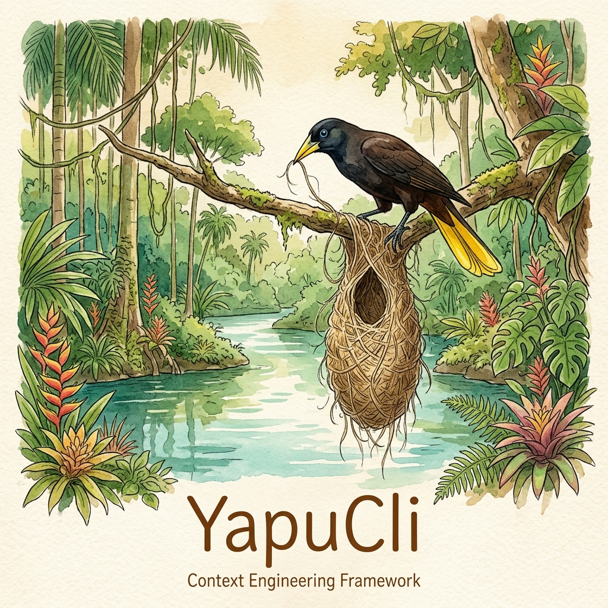

<p align="center">
  
</p>

<p align="center">
  <strong>🇻🇪 <a href="README.es.md">Leer en Español</a></strong>
</p>

# YapuCli 🪺

**Context engineering and static memory framework for AI coding agents (Antigravity, Claude Code, Codex).**
Directly connected to the Antigravity brain.

> Inspired by the **yapú** (*Psarocolius decumanus*), a Venezuelan bird that weaves hanging nests over a meter long that defy gravity.
> Antigravity is the tree — Yapu weaves the memory nest. 🪺

---

## 🚀 Quick Start (60-Second Onboarding)

### 1. Installation & Foundation
Go into your project directory and run the Yapu initializer:

```bash
npx @davidsd/yapu-cli init
```

*This scaffolds the core static memory files (`PROJECT.md`, `ROADMAP.md`, `STATE.md`) along with the `.planning/` directory.*

### 2. Align Your AI
Open your AI chat interface (Cursor, Cline, Windsurf, etc.) and kick off the session with this exact prompt:

> **Initial Prompt:** "Read the `PROJECT.md`, `ROADMAP.md`, and `STATE.md` files to understand our application's rules, the general roadmap, and today's active tasks. Please grab the first pending task from `STATE.md` and let's start writing some code!"

### 3. Real-Time Dashboard
As your AI assistant codes and checks off tasks (`[x]`), you can open a secondary terminal to run the interactive dashboard:

```bash
npx @davidsd/yapu-cli dash
```

*Enjoy a beautiful, zero-dependency TUI dashboard showing week's worth of progress in real time!*

---

### 📦 Traditional Installation (Optional)

If you prefer to have YapuCli globally available on your system, you can install it using:

```bash
npm install -g @davidsd/yapu-cli
# or with pnpm
pnpm add -g @davidsd/yapu-cli
# or with yarn
yarn global add @davidsd/yapu-cli
```

Once globally installed, you can run any command directly using `yapu` (e.g., `yapu init`, `yapu dash`, etc.).

**Zero dependencies** — built natively using `node:fs` and `node:path`.

🤖 **Are you an AI (or do you use one)?** Load the [LLM Installer Prompt](docs/LLM_INSTALLER.md) into your agent so it automatically installs, configures, and assimilates the Yapu rules.

💡 **Do you code with AI?** Read the [Vibe Coder Workflow Guide](docs/WORKFLOW.md) to learn how to integrate Yapu into your daily routine with Cursor/Cline/Windsurf.

---

## 🧠 Dual Memory — The Core Architecture

The Antigravity brain is **ephemeral** (per conversation). The `.planning/` directory is **persistent** (per project, lives in git). Yapu is the bridge that synchronizes both worlds.

```
┌─────────────────────────┐       yapu sync        ┌─────────────────────────┐
│   🧠 Antigravity Brain  │ ◄────────────────────► │   🪺 .planning/         │
│   (ephemeral, per session)│       yapu handoff      │   (persistent, in git)  │
└────────────┬────────────┘                         └────────────┬────────────┘
             │                                                   │
             │            ┌───────────────────┐                  │
             └───────────►│    Memory Triad   │◄─────────────────┘
                          │  PROJECT · ROADMAP │
                          │      · STATE       │
                          └───────────────────┘
```

**Automatic Sync:** Every workflow features embedded **Pre-Sync** (reads inherited state) and **Post-Sync** (persists progress) blocks. The LLM never loses track between sessions.

---

## 📜 The Memory Triad

| File            | Role                 | Description                                                     |
|-----------------|----------------------|-----------------------------------------------------------------|
| `PROJECT.md`    | 🏛️ The Vision         | Stack, architectural rules, and untouchable commandments.       |
| `ROADMAP.md`    | 🗺️ The Macro Plan     | Sequential project phases. Skipping phases is strictly forbidden. |
| `STATE.md`      | ⚡ Operating State    | Active mode, current phase, and short-term technical tasks.     |

---

## 🛠️ CLI Commands (22)

```bash
yapu init              # 🪺 Founds the colony (.planning/ + complete skills)
yapu status            # 📊 Project radiograph
yapu dash              # 📟 Real-time TUI dashboard (Zero-dependency)
yapu board [--port N]  # 🌐 Web Command Center (C2) — interactive browser dashboard
yapu gc                # 🗑️ Contextual Garbage Collector (condenses history)
yapu rescue <log>      # 🚑 Auto-Heal: reads a CI/CD error log and prepares a fix
yapu archive           # 📦 Season finale (freezes tasks into HISTORY.md)
yapu install-hooks     # 🐝 Deploys the hornet's nest (Yapu Guard)
yapu sync              # 🔄 Syncs Antigravity brain → .planning/
yapu handoff           # 🤝 Generates handoff for the next session
yapu brain <list|log>  # 🔍 Inspects the Antigravity brain
yapu provider          # 🔍 Diagnostics of detected AI providers
```

### Command Details

- **`yapu init`** — Scaffolds `.planning/` with 11 subdirectories + 5 base files. Copies 41 workflows, 25 references, 3 contexts, and 5 codebase templates to `.agents/skills/`. It also copies `PROJECT.md`, `ROADMAP.md` and `STATE.md` to the project root. Never overwrites existing files.
- **`yapu status`** — Reads `STATE.md` and reports operational mode, active phase, task list, and spec integrity.
- **`yapu dash`** — Renders an interactive TUI monitor at 60FPS reading `ROADMAP.md` and AI logs (Zero dependencies).
- **`yapu board [--port N]`** — Launches a local web Command Center (C2) with real-time SSE streaming, interactive task toggles, neural feed, and whitelisted command execution. Zero dependencies.
- **`yapu gc`** — Archives old phases from `.planning/phases/` and prepares token compression (Contextual Garbage Collector).
- **`yapu rescue <log>`** — Instantly creates an Auto-Heal debugging session and instructions for your AI based on an error log.
- **`yapu archive`** — Freezes completed tasks from `STATE.md` into `HISTORY.md` with a timestamp.
- **`yapu install-hooks`** — Deploys **Yapu Guard**, an ultra-fast native pre-commit hook (<1.5s).
- **`yapu sync --brain-path <path>`** — Manual fallback: syncs artifacts from the Antigravity brain to `.planning/`.
- **`yapu handoff`** — Generates `HANDOFF.json` + `.continue-here.md` for session continuity.
- **`yapu brain list --path <path>`** — Lists brain artifacts by type, summary, and date.
- **`yapu brain log --path <path> -n N`** — Displays the last N entries of the conversation log.
- **`yapu provider`** — Diagnostic command that detects installed AI CLI providers (Antigravity, Claude Code, Codex), shows their data paths, session counts, and which provider is currently active.

---

## ⚡ Included Autonomous Agent Workflows
Beyond organization, YapuCli installs advanced templates (`.agents/skills/`) so your AI can act as a complete engineering team:
- **LORE_MASTER**: Condenses thousands of context tokens into a single ultra-dense `LORE.md`.
- **PRODUCTION GUARDIAN**: Auto-Heal workflow triggered via `yapu rescue` in CI/CD pipelines.
- **CHAOS MONKEY (`yapu-chaos.md`)**: Autonomous Resilience Engineering. Command your AI to execute this mode to inject latency and break dependencies intentionally, then repair the architecture to achieve Graceful Degradation.

---

## 📂 Structure of `.planning/`

```
.planning/
├── STATE.md
├── ROADMAP.md
├── REQUIREMENTS.md
├── METHODOLOGY.md
├── config.json
├── codebase/       # 7 analysis docs (generated by yapu-map)
├── phases/         # CONTEXT.md, PLAN.md, SUMMARY.md per phase
├── debug/          # Debugging session tracking
├── seeds/          # Forward-looking ideas
├── notes/
├── todos/
├── research/
├── quick/
└── spikes/
```

---

## ⚡ Skill Arsenal (85 files)

**41 workflows · 11 schemas · 25 references · 3 contexts · 5 codebase templates**

### 1. Base Flow 🪺
`map` · `plan` · `execute` · `verify`

### 2. Grill & Spec 🔥
`grill-me` · `grill-docs` · `spec`

### 3. Elite Squads 🎯
`secops` · `dba` · `ui` · `forensics`

### 4. Discovery 🔬
`discovery` · `discuss` · `research`

### 5. Session Management 📋
`resume` · `progress` · `session-report` · `handoff`

### 6. Utilities 🔧
`debug` · `seed` · `quick` · `thread` · `health` · `audit` · `code-review` · `docs` · `tests` · `undo` · `ship` · `sketch` · `autonomous` · `learnings`

---

## 🧪 Tests & Infrastructure

29 integration tests passing · ESLint clean

```bash
npm run test    # Full integration test suite
npm run lint    # Static validation
```

---

## 🪺 Philosophy

> *The yapú does not improvise: every fiber of the nest has a structural purpose.*

Yapu applies this exact principle to the LLM context — explicit static memory, deterministic synchronization, and zero external dependencies. The agent always knows where it is, what it did, and what comes next.

---

<p align="center"><strong>YapuCli 🪺</strong> — The nest that defies gravity.</p>
